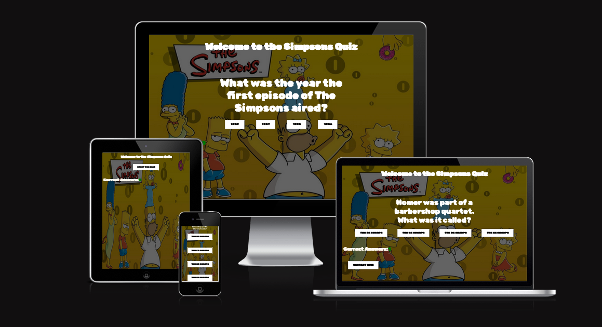

# The Simpsons Quiz #

The Simpsons Quiz is a website with a short fun interactive quiz . Simpsons fans can test their knowledge with this short interactive quiz.



## UX/UI ##

   * A colourful cartoon background was chosen which displays all memebers of the Simpsons family. This background gives the site user a clear idea what the theme of the site is about.
   * The website has very clear navigational to allow the user easily start the quiz.
   * There is a fun favicon added of Homer Simpsons Head.

## Features ##

 * Navigation

    * The homepage prompts you with a clear "Start Quiz" button which encourages the user to begin the quiz.
    * On beginning the quiz the first question appears. Once you select your answer ypu will automatically be prompted with the next question. There is a total of ten questions. 
    * Once the first question loads a restart button appears which allows the user restart the quiz at anytime and resets the score back to zero. Clicking on the header also allows the user to restart the quiz. 
   

    

 * Questions

    * The quiz asks 10 questions in total.
    * The quiz is multiple choice and each questions has 4 possible answers to choose from.
    * The questions appear in a different order each time the user takles the quiz.
    
    

 * Score counter

    * There is a score counter on the bottom of the page once the quiz starts to keep count of how many correct answers the user gives. 
    * Correct answers are highlighted in green.   

    

# Testing #

   * This site works in different browsers, Chrome , Safari & Firefox

   **Firefox**


   **Chrome**


   **Safari**


   * The site is responsive and reacts well to different screen sizes.
   * I confirmed that the navigational links work, are easy to understand and all content text is readable.
   * I confirmed that the questions do load and that the score counter does indeed keep track of all correct scores.

**Bugs** 

*Solved Problems*

   * The main background caused the tezt to become unreadable. Creating a darker backgrouynd solved this and brighter text solved this.
   * On a smaller screen a bit white space formed between the about us section and the main video banner. This was becasue I had a height define for the video and removing this fixed it. 
   * The text in the about us section lost its bullet points on smaller screens. Converting a pixel margin setting to em solved this.

**Validator Testing**

* HTML
   * No errors were retuned when passing through the official W3C validator

```
https://validator.w3.org/nu/?doc=https%3A%2F%2Foconnorian3.github.io%2Fsimpsons-quiz%2F

```

* CSS
   * No errors were retuned when passing through the official (Jigsaw) validator

```
https://jigsaw.w3.org/css-validator/validator?uri=https%3A%2F%2Foconnorian3.github.io%2Fsimpsons-quiz%2F&profile=css3svg&usermedium=all&warning=1&vextwarning=&lang=en
```
    
* Accessibility
   * The colours and fonts are easy to read by passing it through the lighthouse in dev tools.

   
```
https://pagespeed.web.dev/report?url=https%3A%2F%2Foconnorian3.github.io%2Fsimpsons-quiz%2F&form_factor=mobile

```    

# Deployment #

**The site was deployed to GitHub pages. The steps to deploy are as follows:**
   * In the GitHub repository, navigate to the Settings tab
   * From the source section drop-down menu, select the Master Branch
   * Once the master branch has been selected, the page will be automatically refreshed with a detailed ribbon display to indicate the successful deployment.

   * The live link can be found here - https://oconnorian3.github.io/simpsons-quiz/

# Credits #

**Content** 
   * I watched this video for some guidance and ideas on how to begin my quiz https://www.youtube.com/watch?v=riDzcEQbX6k
   * I copied some questions from https://www.radiotimes.com/tv/comedy/pub-quiz-the-simpsons/ and https://thoughtcatalog.com/january-nelson/2021/09/simpsons-trivia/ to add to my quiz.

**Media**

   * The background was found on https://www.wallpaperflare.com 
   * The favicon image was found on pexels.com
